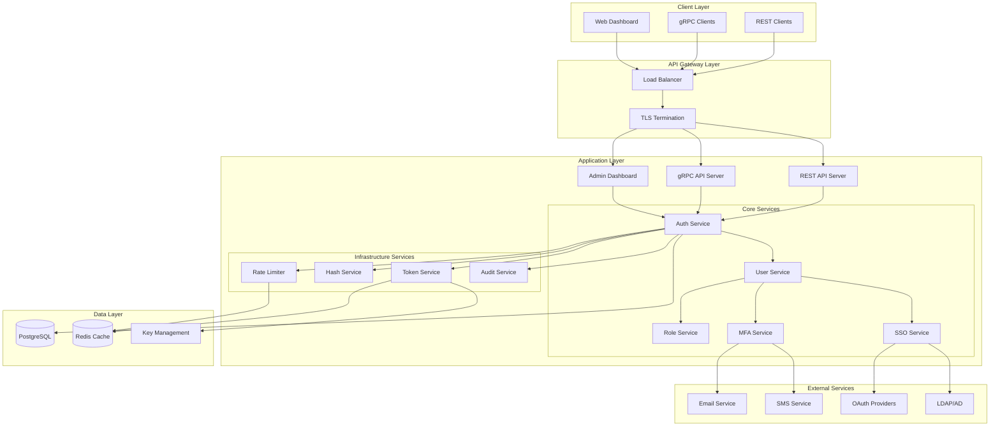

# Design Document

## Overview

The authentication backend system is designed as a flexible, enterprise-grade authentication service built in Go. It follows a layered architecture with clear separation of concerns, supporting both monolithic and microservice deployment patterns. The system provides dual protocol support (REST/gRPC), configurable security mechanisms, and comprehensive enterprise features.

### Key Design Principles

- **Protocol Agnostic**: Core business logic is independent of transport protocols
- **Configuration-Driven**: Security algorithms and features are configurable without code changes
- **Stateless Design**: Enables horizontal scaling and cloud-native deployments
- **Modular Architecture**: Components can be deployed independently or together
- **Security First**: Defense in depth with multiple security layers

## Architecture

### High-Level Architecture



### Service Architecture Pattern

The system follows a **Service-Oriented Architecture** with the following layers:

1. **Transport Layer**: REST and gRPC servers handling protocol-specific concerns
2. **Service Layer**: Business logic implementation with clear interfaces
3. **Repository Layer**: Data access abstraction using SQLC-generated code
4. **Infrastructure Layer**: Cross-cutting concerns like caching, logging, metrics

## Components and Interfaces

### Core Service Interfaces

```go
// AuthService handles core authentication operations
type AuthService interface {
    Register(ctx context.Context, req RegisterRequest) (*RegisterResponse, error)
    Login(ctx context.Context, req LoginRequest) (*LoginResponse, error)
    Logout(ctx context.Context, req LogoutRequest) error
    RefreshToken(ctx context.Context, req RefreshRequest) (*TokenResponse, error)
    ValidateToken(ctx context.Context, token string) (*TokenClaims, error)
}

// UserService manages user profiles and data
type UserService interface {
    GetProfile(ctx context.Context, userID string) (*UserProfile, error)
    UpdateProfile(ctx context.Context, userID string, req UpdateProfileRequest) error
    DeleteUser(ctx context.Context, userID string) error
    ListUsers(ctx context.Context, req ListUsersRequest) (*ListUsersResponse, error)
}

// TokenService handles token generation and validation
type TokenService interface {
    GenerateTokens(ctx context.Context, userID string, claims TokenClaims) (*TokenPair, error)
    ValidateToken(ctx context.Context, token string) (*TokenClaims, error)
    RefreshToken(ctx context.Context, refreshToken string) (*TokenPair, error)
    RevokeToken(ctx context.Context, token string) error
}

// HashService provides configurable password hashing
type HashService interface {
    HashPassword(password string) (string, error)
    VerifyPassword(password, hash string) error
    NeedsRehash(hash string) bool
}
```

### Configuration System

```go
type Config struct {
    Server     ServerConfig     `yaml:"server"`
    Database   DatabaseConfig   `yaml:"database"`
    Redis      RedisConfig      `yaml:"redis"`
    Security   SecurityConfig   `yaml:"security"`
    Features   FeaturesConfig   `yaml:"features"`
    External   ExternalConfig   `yaml:"external"`
}

type SecurityConfig struct {
    PasswordHash PasswordHashConfig `yaml:"password_hash"`
    TokenConfig  TokenConfig        `yaml:"token"`
    RateLimit    RateLimitConfig    `yaml:"rate_limit"`
    Encryption   EncryptionConfig   `yaml:"encryption"`
}

type PasswordHashConfig struct {
    Algorithm string                 `yaml:"algorithm"` // "argon2" or "bcrypt"
    Argon2    Argon2Config          `yaml:"argon2"`
    Bcrypt    BcryptConfig          `yaml:"bcrypt"`
}

type TokenConfig struct {
    Type           string        `yaml:"type"`            // "jwt" or "paseto"
    AccessTTL      time.Duration `yaml:"access_ttl"`
    RefreshTTL     time.Duration `yaml:"refresh_ttl"`
    SigningKey     string        `yaml:"signing_key"`
    EncryptionKey  string        `yaml:"encryption_key"`
}
```

### Protocol Adapters

#### REST API Structure

```
/api/v1/
├── auth/
│   ├── register          POST
│   ├── login            POST
│   ├── logout           POST
│   ├── refresh          POST
│   └── validate         POST
├── users/
│   ├── profile          GET, PUT
│   ├── {id}            GET, PUT, DELETE
│   └── list            GET
├── roles/
│   ├── {id}            GET, PUT, DELETE
│   ├── list            GET
│   └── permissions     GET, PUT
├── mfa/
│   ├── setup           POST
│   ├── verify          POST
│   └── disable         POST
└── admin/
    ├── users           GET, POST
    ├── metrics         GET
    └── config          GET, PUT
```

#### gRPC Service Definitions

```protobuf
service AuthService {
  rpc Register(RegisterRequest) returns (RegisterResponse);
  rpc Login(LoginRequest) returns (LoginResponse);
  rpc Logout(LogoutRequest) returns (LogoutResponse);
  rpc RefreshToken(RefreshTokenRequest) returns (TokenResponse);
  rpc ValidateToken(ValidateTokenRequest) returns (ValidateTokenResponse);
}

service UserService {
  rpc GetProfile(GetProfileRequest) returns (UserProfile);
  rpc UpdateProfile(UpdateProfileRequest) returns (UpdateProfileResponse);
  rpc ListUsers(ListUsersRequest) returns (ListUsersResponse);
  rpc DeleteUser(DeleteUserRequest) returns (DeleteUserResponse);
}

service RoleService {
  rpc CreateRole(CreateRoleRequest) returns (Role);
  rpc GetRole(GetRoleRequest) returns (Role);
  rpc UpdateRole(UpdateRoleRequest) returns (Role);
  rpc DeleteRole(DeleteRoleRequest) returns (DeleteRoleResponse);
  rpc ListRoles(ListRolesRequest) returns (ListRolesResponse);
}
```

## Data Models

### Database Schema Design

#### Core Tables

```sql
-- Users table with encrypted PII
CREATE TABLE users (
    id UUID PRIMARY KEY DEFAULT gen_random_uuid(),
    email VARCHAR(255) UNIQUE NOT NULL,
    username VARCHAR(100) UNIQUE,
    password_hash TEXT NOT NULL,
    hash_algorithm VARCHAR(20) NOT NULL DEFAULT 'argon2',
    first_name_encrypted BYTEA,
    last_name_encrypted BYTEA,
    phone_encrypted BYTEA,
    email_verified BOOLEAN DEFAULT FALSE,
    phone_verified BOOLEAN DEFAULT FALSE,
    account_locked BOOLEAN DEFAULT FALSE,
    failed_login_attempts INTEGER DEFAULT 0,
    last_login_at TIMESTAMP,
    created_at TIMESTAMP DEFAULT NOW(),
    updated_at TIMESTAMP DEFAULT NOW()
);

-- Roles and permissions
CREATE TABLE roles (
    id UUID PRIMARY KEY DEFAULT gen_random_uuid(),
    name VARCHAR(100) UNIQUE NOT NULL,
    description TEXT,
    permissions JSONB NOT NULL DEFAULT '[]',
    created_at TIMESTAMP DEFAULT NOW(),
    updated_at TIMESTAMP DEFAULT NOW()
);

CREATE TABLE user_roles (
    user_id UUID REFERENCES users(id) ON DELETE CASCADE,
    role_id UUID REFERENCES roles(id) ON DELETE CASCADE,
    assigned_at TIMESTAMP DEFAULT NOW(),
    assigned_by UUID REFERENCES users(id),
    PRIMARY KEY (user_id, role_id)
);

-- Sessions and tokens
CREATE TABLE user_sessions (
    id UUID PRIMARY KEY DEFAULT gen_random_uuid(),
    user_id UUID REFERENCES users(id) ON DELETE CASCADE,
    token_hash VARCHAR(255) UNIQUE NOT NULL,
    token_type VARCHAR(20) NOT NULL, -- 'access', 'refresh'
    expires_at TIMESTAMP NOT NULL,
    created_at TIMESTAMP DEFAULT NOW(),
    last_used_at TIMESTAMP DEFAULT NOW(),
    ip_address INET,
    user_agent TEXT
);

-- MFA configurations
CREATE TABLE user_mfa (
    id UUID PRIMARY KEY DEFAULT gen_random_uuid(),
    user_id UUID REFERENCES users(id) ON DELETE CASCADE,
    method VARCHAR(20) NOT NULL, -- 'totp', 'sms', 'email', 'webauthn'
    secret_encrypted BYTEA,
    backup_codes_encrypted BYTEA,
    enabled BOOLEAN DEFAULT FALSE,
    created_at TIMESTAMP DEFAULT NOW(),
    last_used_at TIMESTAMP
);

-- Audit logs
CREATE TABLE audit_logs (
    id UUID PRIMARY KEY DEFAULT gen_random_uuid(),
    user_id UUID REFERENCES users(id),
    action VARCHAR(100) NOT NULL,
    resource_type VARCHAR(50),
    resource_id VARCHAR(255),
    ip_address INET,
    user_agent TEXT,
    metadata JSONB,
    timestamp TIMESTAMP DEFAULT NOW()
);
```

#### SQLC Integration

SQLC queries will be organized by domain:

```
sql/
├── queries/
│   ├── users.sql
│   ├── roles.sql
│   ├── sessions.sql
│   ├── mfa.sql
│   └── audit.sql
├── migrations/
│   ├── 001_initial_schema.up.sql
│   ├── 001_initial_schema.down.sql
│   └── ...
└── sqlc.yaml
```

### Redis Data Structures

```go
// Session storage
type SessionData struct {
    UserID    string    `json:"user_id"`
    Roles     []string  `json:"roles"`
    ExpiresAt time.Time `json:"expires_at"`
    IPAddress string    `json:"ip_address"`
}

// Rate limiting
type RateLimitData struct {
    Count     int       `json:"count"`
    ResetTime time.Time `json:"reset_time"`
    Blocked   bool      `json:"blocked"`
}

// Token blacklist
type BlacklistedToken struct {
    TokenHash string    `json:"token_hash"`
    ExpiresAt time.Time `json:"expires_at"`
    Reason    string    `json:"reason"`
}
```

## Error Handling

### Error Classification

```go
type ErrorType string

const (
    ErrorTypeValidation     ErrorType = "validation"
    ErrorTypeAuthentication ErrorType = "authentication"
    ErrorTypeAuthorization  ErrorType = "authorization"
    ErrorTypeNotFound       ErrorType = "not_found"
    ErrorTypeConflict       ErrorType = "conflict"
    ErrorTypeRateLimit      ErrorType = "rate_limit"
    ErrorTypeInternal       ErrorType = "internal"
    ErrorTypeExternal       ErrorType = "external"
)

type AppError struct {
    Type    ErrorType `json:"type"`
    Code    string    `json:"code"`
    Message string    `json:"message"`
    Details any       `json:"details,omitempty"`
}
```

### Error Response Format

```go
// REST API Error Response
type ErrorResponse struct {
    Error   AppError  `json:"error"`
    TraceID string    `json:"trace_id"`
    Time    time.Time `json:"timestamp"`
}

// gRPC Error Handling
func (s *authServer) handleError(err error) error {
    appErr, ok := err.(*AppError)
    if !ok {
        return status.Error(codes.Internal, "internal server error")
    }
    
    switch appErr.Type {
    case ErrorTypeValidation:
        return status.Error(codes.InvalidArgument, appErr.Message)
    case ErrorTypeAuthentication:
        return status.Error(codes.Unauthenticated, appErr.Message)
    case ErrorTypeAuthorization:
        return status.Error(codes.PermissionDenied, appErr.Message)
    case ErrorTypeNotFound:
        return status.Error(codes.NotFound, appErr.Message)
    case ErrorTypeRateLimit:
        return status.Error(codes.ResourceExhausted, appErr.Message)
    default:
        return status.Error(codes.Internal, "internal server error")
    }
}
```

## Testing Strategy

### Testing Pyramid

1. **Unit Tests (70%)**
   - Service layer business logic
   - Utility functions and helpers
   - Configuration validation
   - Password hashing and token generation

2. **Integration Tests (20%)**
   - Database operations with test containers
   - Redis caching functionality
   - External service integrations
   - End-to-end API workflows

3. **End-to-End Tests (10%)**
   - Full authentication flows
   - Multi-protocol compatibility
   - Admin dashboard functionality
   - Performance and load testing

### Test Infrastructure

```go
// Test utilities
type TestSuite struct {
    DB     *sql.DB
    Redis  *redis.Client
    Config *Config
    Server *httptest.Server
}

func (ts *TestSuite) SetupTest() {
    // Initialize test database with migrations
    // Setup Redis test instance
    // Create test configuration
    // Start test server
}

func (ts *TestSuite) TearDownTest() {
    // Clean up test data
    // Close connections
}
```

### Mock Interfaces

```go
//go:generate mockgen -source=auth_service.go -destination=mocks/auth_service_mock.go
//go:generate mockgen -source=token_service.go -destination=mocks/token_service_mock.go
//go:generate mockgen -source=hash_service.go -destination=mocks/hash_service_mock.go
```

## Security Considerations

### Data Protection

1. **Encryption at Rest**
   - PII fields encrypted using AES-256-GCM
   - Database-level encryption for sensitive tables
   - Key rotation support through external key management

2. **Encryption in Transit**
   - TLS 1.3 for all external communications
   - mTLS for internal service communication
   - Certificate management and rotation

3. **Token Security**
   - JWT signed with RS256 or ES256
   - Paseto v4 with encryption for sensitive claims
   - Short-lived access tokens with secure refresh mechanism

### Threat Mitigation

1. **Rate Limiting**
   - Sliding window algorithm implementation
   - Per-IP and per-user rate limits
   - Distributed rate limiting across instances

2. **Account Security**
   - Progressive delays for failed login attempts
   - Account lockout with admin override
   - Suspicious activity detection and alerting

3. **Input Validation**
   - Comprehensive input sanitization
   - SQL injection prevention through parameterized queries
   - XSS protection in admin dashboard

## Performance and Scalability

### Caching Strategy

1. **Application-Level Caching**
   - User profile caching with TTL
   - Role and permission caching
   - Configuration caching with invalidation

2. **Database Optimization**
   - Connection pooling with pgxpool
   - Read replicas for query distribution
   - Database query optimization and indexing

3. **Redis Usage Patterns**
   - Session storage with automatic expiration
   - Rate limiting counters
   - Token blacklist with TTL cleanup

### Horizontal Scaling

1. **Stateless Design**
   - No server-side session storage
   - Configuration through environment variables
   - Database connection pooling

2. **Load Balancing**
   - Health check endpoints for load balancers
   - Graceful shutdown handling
   - Circuit breaker pattern for external services

### Monitoring and Metrics

1. **Application Metrics**
   - Authentication success/failure rates
   - Token generation and validation latency
   - Database query performance
   - Cache hit/miss ratios

2. **Infrastructure Metrics**
   - CPU, memory, and network utilization
   - Database connection pool status
   - Redis memory usage and performance

3. **Business Metrics**
   - User registration and login trends
   - MFA adoption rates
   - Failed authentication patterns